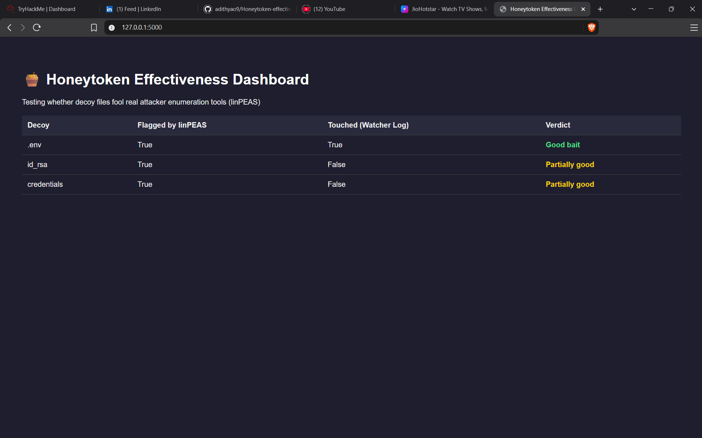

# Honeytoken Effectiveness Tester

Most honeytoken/deception tools (Canarytokens, Honeybits, etc.) assume that if you plant a fake credential file somewhere, an attacker's tool will notice it and trigger an alert. Nobody really checks if that assumption holds. I wanted to test it properly instead of just trusting it.

## What it does

The idea is simple: plant some fake bait (a fake `.env`, a fake SSH key, fake AWS credentials), then run a real attacker tool against it and see what actually gets flagged, versus what my own file watcher picks up.

I used linPEAS for the attack side since it's a real, widely used Linux enumeration script pentesters actually run. Everything runs inside a Docker container so nothing touches my actual machine.


## The pipeline

1. `plant_decoys.py` generates the fake files
2. `watcher.py` watches those files and logs any access (modify/create/delete)
3. The decoys get copied into a Docker container
4. linPEAS runs inside the container and scans everything
5. `score.py` compares what linPEAS found against what the watcher logged
6. A small Flask dashboard shows the results

## What I actually found

This was the interesting part. linPEAS found all three decoys, it lists them in its scan output. But my watcher only caught one of them (`.env`) as "touched." The other two (`id_rsa`, `credentials`) never triggered the watcher at all.

Turns out this makes sense once you think about it: linPEAS just *reads* files to scan them, it doesn't modify them. My watcher only reacts to modifications, creations, and deletions, not reads. So it completely missed a tool actively scanning the files.

This is actually a decent finding on its own: **a watcher that only checks for file changes will miss read-only reconnaissance.** If you're building a real detection system around honeytokens, watching for modifications alone isn't enough, you'd need something like `auditd` to catch reads too.

## Running it yourself

```bash
python plant_decoys.py
python watcher.py          # separate terminal, leave running

docker build -t honeytoken-lab .
docker run -it honeytoken-lab

# inside the container:
curl -L https://github.com/peass-ng/PEASS-ng/releases/latest/download/linpeas.sh -o linpeas.sh
chmod +x linpeas.sh
./linpeas.sh > linpeas_output.txt 2>&1

# back on host machine:
docker cp <container_id>:/home/employee/linpeas_output.txt ./linpeas_output.txt
python score.py
python app.py   # then open http://127.0.0.1:5000
```

## Limitations

- Watcher currently misses read-only access, only catches modify/create/delete. Fixing this properly would mean switching to something like `auditd`, which I didn't get to yet.
- Only tested against linPEAS so far. Would be worth trying LinEnum or similar to see if the same gap shows up.
- Decoy content is static right now, same fake values every time. Randomizing this a bit would make it more realistic.

## Why this is different from Canarytokens / Honeybits

Those tools are built to generate and alert on decoys. This one is built to test whether the decoys actually work against a real recon tool, which as far as I could find, isn't something existing tools measure directly.

## License

MIT